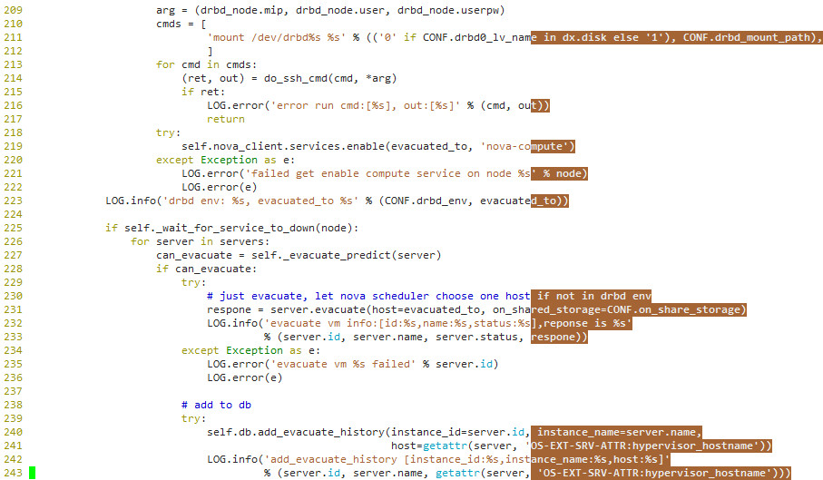

----------
code style
----------

比较普遍的2处

1 一行超过79个字符
------------------

一般情况下一行不得超过79个字符

2 类和方法的块说明（block of comment lines）
--------------------------------------------

对每个类和方法以及方法对应的参数几乎没有说明。每个类和方法应该有详尽的说明，特别是重要的方法，行数较多逻辑复杂的方法还需重点说明。每个方法的参数和返回值需要有解释，特别光看单词不易理解的参数。

3 注释
------

注释较少，且不平均

